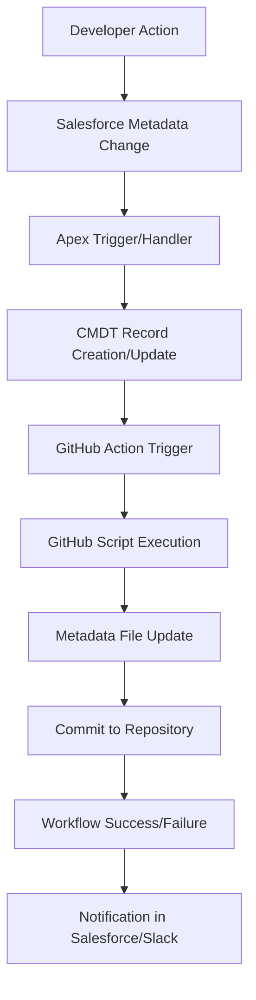
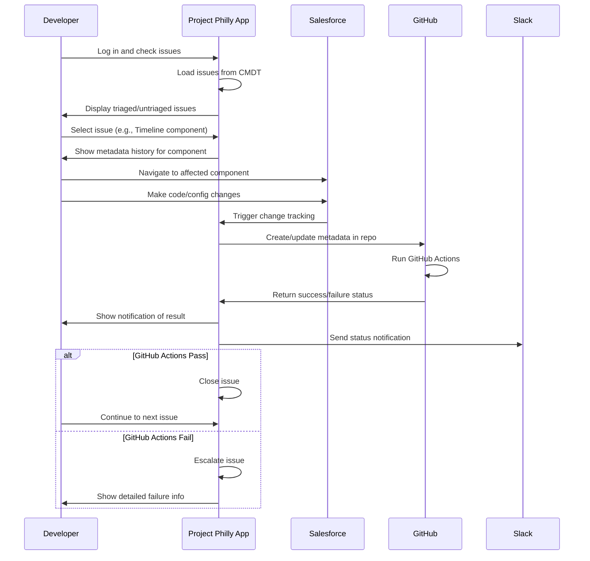

# Project Philly Documentation Framework

## Directory Structure

```
/project-philly/
  /docs/
    README.md                       # Documentation overview and guide
    /architecture/
      overview.md                   # System architecture and design
      data-model.md                 # CMDT and object structure
      integration-patterns.md       # GitHub and Salesforce integration
    /components/
      /salesforce/
        devassist-app.md            # DevAssist Salesforce App
        lwc-components.md           # Lightning Web Components
        apex-services.md            # Apex classes and their responsibilities
        custom-metadata-types.md    # CMDT structure and relationships
      /github/
        actions-overview.md         # GitHub Actions overview
        workflows.md                # Workflow documentation
        scripts.md                  # JS scripts for CMDT creation/updates
    /user-flows/
      issue-identification.md       # Finding and tracking issues
      metadata-change-tracking.md   # Following metadata changes
      github-integration.md         # GitHub integration flows
      notifications.md              # Slack and in-app notifications
    /setup-guides/
      installation.md               # Installation instructions
      configuration.md              # Configuration steps
      permissions.md                # Required permissions and access
    /development/
      contribution-guide.md         # How to contribute
      testing.md                    # Testing procedures
      release-process.md            # Release process documentation
```

## Template Files

The following sections provide templates for key documentation files.

---

### 1. Architecture Overview Template

```markdown
# Project Philly Architecture Overview

## System Components

Project Philly consists of the following key components:

1. **DevAssist Salesforce App** - The primary user interface within Salesforce
2. **Custom Metadata Types** - For tracking metadata changes and history
3. **Apex Services** - Backend services for GitHub integration and metadata tracking
4. **Lightning Web Components** - UI components for displaying metadata info
5. **GitHub Actions & Workflows** - Automation for syncing metadata between systems

## Integration Architecture



## Data Flow

1. **Metadata Change Detection**
   - Changes detected via Apex triggers or GitHub webhooks
   - Changes categorized by source (manual, Brix deployment, config change)

2. **Metadata Record Creation**
   - CMDT records created/updated reflecting the changes
   - Metadata linked to GitHub repositories and file paths

3. **Notification & Visualization**
   - Changes surfaced in DevAssist UI
   - Notifications sent to appropriate channels
   - Dashboard aggregation for trend analysis

## Security Model

- Named Credentials for GitHub authentication
- Permission sets controlling access to DevAssist
- Secure handling of GitHub PATs

## Integration Points

| System | Integration Method | Data Direction | Purpose |
|--------|-------------------|----------------|---------|
| GitHub | API via Named Credential | Bi-directional | Metadata synchronization |
| Slack | API | Outbound | Notifications |
| Salesforce | Direct | - | Application home |
```

---

### 2. Component Documentation Template (Apex Services)

```markdown
# Apex Services

## Overview

The Apex services in Project Philly handle the integration between Salesforce metadata, Custom Metadata Types (CMDT), and GitHub. They provide the backend functionality for tracking changes, deploying metadata, and communicating with GitHub.

## Key Services

<details>
<summary><strong>GitHubService</strong></summary>

### Purpose
Handles API communication with GitHub repositories to fetch and update metadata files.

### Key Methods

```apex
/**
 * Fetches a file from GitHub repository
 * @param owner The repository owner
 * @param repo The repository name
 * @param path The file path within the repository
 * @return The file content as a string
 */
public static String fetchFileFromRepo(String owner, String repo, String path) {
    // Implementation details
}

/**
 * Creates or updates a file in GitHub repository
 * @param owner The repository owner
 * @param repo The repository name
 * @param path The file path within the repository
 * @param content The file content
 * @param message The commit message
 * @param branch The branch name
 * @return The commit SHA
 */
public static String updateFileInRepo(String owner, String repo, String path, 
                                     String content, String message, String branch) {
    // Implementation details
}
```

### Integration Points
- Uses Named Credential `GitHubPat` for authentication
- Communicates with GitHub REST API
- Called by other Apex classes for GitHub operations
</details>

<details>
<summary><strong>GitHubMetadataChangeTracker</strong></summary>

### Purpose
Tracks metadata changes that originate from GitHub deployments and creates CMDT records.

### Key Methods

```apex
/**
 * Processes metadata changes from GitHub
 * @param metadata The metadata information
 * @param commitSha The GitHub commit SHA
 * @return The ID of the created CMDT record
 */
public static Id trackMetadataChange(Map<String, Object> metadata, String commitSha) {
    // Implementation details
}
```

### Integration Points
- Creates DevAssist_Metadata__mdt and DevAssist_Metadata_History__mdt records
- Invoked by GitHub webhook or after deployment process
</details>

<details>
<summary><strong>AdminMetadataChangeTracker</strong></summary>

### Purpose
Tracks metadata changes made directly in the Salesforce org by administrators or developers.

### Key Methods

```apex
/**
 * Tracks manual metadata changes in the org
 * @param metadataType The type of metadata
 * @param metadataName The name of the metadata
 * @param changeType The type of change (Create, Update, Delete)
 * @return The ID of the created CMDT record
 */
public static Id trackManualChange(String metadataType, String metadataName, String changeType) {
    // Implementation details
}
```

### Integration Points
- Creates DevAssist_Metadata__mdt and DevAssist_Metadata_History__mdt records
- Triggered by Apex triggers on metadata changes
</details>

<details>
<summary><strong>DevAssistMetadataDeployer</strong></summary>

### Purpose
Handles deployment of metadata from GitHub to Salesforce.

### Key Methods

```apex
/**
 * Deploys metadata from GitHub to Salesforce
 * @param owner The repository owner
 * @param repo The repository name
 * @param path The file path within the repository
 * @param targetMetadataType The Salesforce metadata type
 * @return The deployment result
 */
public static DeployResult deployFromGitHub(String owner, String repo, 
                                          String path, String targetMetadataType) {
    // Implementation details
}
```

### Integration Points
- Uses GitHubService to fetch metadata
- Utilizes Salesforce Metadata API for deployment
- Updates CMDT records after successful deployment
</details>

<details>
<summary><strong>ReleaseNoteCmdtHandler</strong></summary>

### Purpose
Manages the creation and updating of release notes based on metadata changes.

### Key Methods

```apex
/**
 * Generates release notes from metadata changes
 * @param startDate The start date for changes
 * @param endDate The end date for changes
 * @return The generated release notes
 */
public static String generateReleaseNotes(DateTime startDate, DateTime endDate) {
    // Implementation details
}
```

### Integration Points
- Reads DevAssist_Metadata_History__mdt records
- Formats release notes for different audiences
- Can send notifications through Slack
</details>

## Data Model Integration

These Apex services interact with the following Custom Metadata Types:

- **DevAssist_Metadata__mdt** - Stores current metadata state
- **DevAssist_Metadata_History__mdt** - Stores historical changes to metadata

## Security Considerations

- All GitHub API calls use the GitHubPat Named Credential
- Access to these services is controlled via the DevAssist_App_Access permission set
- Sensitive operations require additional permissions
```

---

### 3. User Flow Documentation Template (Issue Identification)

```markdown
# Issue Identification Flow

## Overview

This document describes the process by which developers identify and resolve issues using Project Philly.

## User Flow Diagram



## Step-by-Step Process

1. **First Stop: Checking PP App for Issues**
   - Developer logs into Salesforce and checks the PP App
   - System displays list of issues (triaged and untriaged)
   - Developer sees all active issues in one place

2. **Identifying the Issue in Context**
   - Developer clicks on specific issue (e.g., Timeline component not displaying correctly)
   - System provides link to failing component in Salesforce
   - Hovering over component reveals metadata change history from CMDT records
   - History includes manual changes, post-spin Brix deployments, and config changes

3. **Fixing the Issue**
   - Developer makes changes directly in org or in relevant repo
   - System triggers CMDT record update and corresponding GitHub Actions
   - Developer receives in-app notification about GitHub Actions status

4. **Handling GitHub Actions Results**
   - On success: Issue is closed, optional Slack notification sent
   - On failure: Issue is escalated for deeper investigation

## Key Interface Elements

| Screen | Purpose | Key Features |
|--------|---------|-------------|
| Issue List | View all current issues | Filter by status, type, component |
| Issue Detail | View specific issue context | Metadata history, component link |
| Metadata History | See all changes to component | Timeline of changes with source |
| Action Status | Monitor GitHub Actions | Real-time status updates |

## User Permissions Required

- DevAssist_App_Access permission set
- Access to relevant Salesforce components
- GitHub repository access (if making changes in GitHub)

## Error Handling

| Error Scenario | System Response | User Action |
|----------------|-----------------|------------|
| GitHub action fails | Error notification, issue escalated | Review error logs, fix code |
| Component access restricted | Permission error message | Request access from admin |
| Metadata conflict | Warning with conflict details | Resolve conflicts manually |

## Related Flows

- [Metadata Change Tracking](./metadata-change-tracking.md)
- [GitHub Integration](./github-integration.md)
- [Notifications](./notifications.md)
```

---

### 4. GitHub Integration Template (GitHub Actions)

```markdown
# GitHub Actions and Workflows

## Overview

Project Philly leverages GitHub Actions to automate the synchronization of metadata between Salesforce and GitHub repositories. These workflows handle tasks such as fetching metadata from Salesforce, creating CMDT records, and validating metadata changes.

## Key Workflows

<details>
<summary><strong>fetch-and-save.yml</strong></summary>

### Purpose
Fetches metadata from Salesforce and saves it to the GitHub repository.

### Triggers
- Manual dispatch
- Scheduled runs (daily)
- Webhook from Salesforce (via external service)

### Steps
1. Authenticate with Salesforce
2. Fetch metadata based on parameters
3. Update repository files
4. Create or update CMDT records
5. Commit changes with details

### Implementation

```yaml
name: Fetch and Save Metadata

on:
  workflow_dispatch:
    inputs:
      metadataType:
        description: 'Type of metadata to fetch'
        required: true
      componentNames:
        description: 'Component names (comma-separated)'
        required: false
  schedule:
    - cron: '0 0 * * *'  # Daily at midnight

jobs:
  fetch-metadata:
    runs-on: ubuntu-latest
    steps:
      - uses: actions/checkout@v2
      - name: Get Salesforce access token
        uses: ./.github/actions/get-access-token-and-instance-url
        with:
          client-id: ${{ secrets.SF_CLIENT_ID }}
          client-secret: ${{ secrets.SF_CLIENT_SECRET }}
          username: ${{ secrets.SF_USERNAME }}
          password: ${{ secrets.SF_PASSWORD }}
          
      - name: Fetch metadata
        uses: ./.github/actions/fetch-sf-metadata
        with:
          access-token: ${{ env.ACCESS_TOKEN }}
          instance-url: ${{ env.INSTANCE_URL }}
          metadata-type: ${{ github.event.inputs.metadataType }}
          component-names: ${{ github.event.inputs.componentNames }}
          
      - name: Save metadata to file
        uses: ./.github/actions/fetch-metadata-to-file
        
      - name: Create CMDT records
        run: node ./.github/scripts/create-current-cmdt.js
        
      - name: Commit changes
        uses: stefanzweifel/git-auto-commit-action@v4
        with:
          commit_message: "Auto-update ${{ github.event.inputs.metadataType }} metadata"
```
</details>

<details>
<summary><strong>Brix-Build.yml</strong></summary>

### Purpose
Builds and deploys Brix components to Salesforce environments.

### Triggers
- Push to specific branches
- Pull request to main branch
- Manual dispatch

### Steps
1. Setup Node.js environment
2. Install dependencies
3. Build Brix components
4. Deploy to Salesforce
5. Update CMDT records
6. Run tests and validate

### Implementation

```yaml
name: Brix Build and Deploy

on:
  push:
    branches: [ main, dev, staging ]
  pull_request:
    branches: [ main ]
  workflow_dispatch:
    inputs:
      environment:
        description: 'Target environment'
        required: true
        default: 'dev'

jobs:
  build-and-deploy:
    runs-on: ubuntu-latest
    steps:
      - uses: actions/checkout@v2
      - name: Use Node.js
        uses: actions/setup-node@v2
        with:
          node-version: '16.x'
          
      - name: Install dependencies
        run: npm ci
        
      - name: Build components
        run: npm run build
        
      - name: Get Salesforce access token
        uses: ./.github/actions/get-access-token-and-instance-url
        with:
          client-id: ${{ secrets.SF_CLIENT_ID }}
          client-secret: ${{ secrets.SF_CLIENT_SECRET }}
          username: ${{ secrets.SF_USERNAME }}
          password: ${{ secrets.SF_PASSWORD }}
          
      - name: Deploy to Salesforce
        run: npm run deploy -- --targetusername ${{ secrets.SF_USERNAME }}
        
      - name: Create CMDT history records
        run: node ./.github/scripts/create-history-cmdt.js
        
      - name: Run tests
        run: npm test
```
</details>

## Custom GitHub Actions

<details>
<summary><strong>get-access-token-and-instance-url</strong></summary>

### Purpose
Authenticates with Salesforce to obtain an access token and instance URL.

### Inputs
- `client-id`: Salesforce connected app client ID
- `client-secret`: Salesforce connected app client secret
- `username`: Salesforce username
- `password`: Salesforce password

### Outputs
- Sets environment variables `ACCESS_TOKEN` and `INSTANCE_URL`

### Implementation

```yaml
name: 'Get Salesforce Access Token'
description: 'Authenticates with Salesforce and obtains an access token'
inputs:
  client-id:
    required: true
    description: 'Salesforce connected app client ID'
  client-secret:
    required: true
    description: 'Salesforce connected app client secret'
  username:
    required: true
    description: 'Salesforce username'
  password:
    required: true
    description: 'Salesforce password'
runs:
  using: 'composite'
  steps:
    - name: Install jq
      shell: bash
      run: sudo apt-get install jq
      
    - name: Get access token
      shell: bash
      run: |
        RESPONSE=$(curl -s https://login.salesforce.com/services/oauth2/token \
          -d "grant_type=password" \
          -d "client_id=${{ inputs.client-id }}" \
          -d "client_secret=${{ inputs.client-secret }}" \
          -d "username=${{ inputs.username }}" \
          -d "password=${{ inputs.password }}")
        
        ACCESS_TOKEN=$(echo $RESPONSE | jq -r '.access_token')
        INSTANCE_URL=$(echo $RESPONSE | jq -r '.instance_url')
        
        echo "ACCESS_TOKEN=$ACCESS_TOKEN" >> $GITHUB_ENV
        echo "INSTANCE_URL=$INSTANCE_URL" >> $GITHUB_ENV
```
</details>

<details>
<summary><strong>fetch-sf-metadata</strong></summary>

### Purpose
Fetches metadata from Salesforce using the Metadata API.

### Inputs
- `access-token`: Salesforce access token
- `instance-url`: Salesforce instance URL
- `metadata-type`: Type of metadata to fetch
- `component-names`: Specific component names to fetch (optional)

### Outputs
- Writes metadata to `metadata-response.json`

### Implementation

```yaml
name: 'Fetch Salesforce Metadata'
description: 'Fetches metadata from Salesforce using the Metadata API'
inputs:
  access-token:
    required: true
    description: 'Salesforce access token'
  instance-url:
    required: true
    description: 'Salesforce instance URL'
  metadata-type:
    required: true
    description: 'Type of metadata to fetch'
  component-names:
    required: false
    description: 'Specific component names to fetch (comma-separated)'
runs:
  using: 'composite'
  steps:
    - name: Prepare request
      shell: bash
      run: |
        COMPONENT_LIST=""
        if [ -n "${{ inputs.component-names }}" ]; then
          IFS=',' read -ra COMPONENTS <<< "${{ inputs.component-names }}"
          for COMPONENT in "${COMPONENTS[@]}"; do
            COMPONENT_LIST+="<members>$COMPONENT</members>"
          done
        else
          COMPONENT_LIST="<members>*</members>"
        fi
        
        REQUEST_BODY="<?xml version=\"1.0\" encoding=\"UTF-8\"?>
        <retrieveRequest>
          <apiVersion>55.0</apiVersion>
          <unpackaged>
            <types>
              $COMPONENT_LIST
              <name>${{ inputs.metadata-type }}</name>
            </types>
          </unpackaged>
        </retrieveRequest>"
        
        echo "$REQUEST_BODY" > retrieve-request.xml
      
    - name: Fetch metadata
      shell: bash
      run: |
        curl -X POST "${{ inputs.instance-url }}/services/data/v55.0/metadata/retrieve" \
          -H "Authorization: Bearer ${{ inputs.access-token }}" \
          -H "Content-Type: application/xml" \
          -d @retrieve-request.xml \
          -o metadata-response.json
```
</details>

## JavaScript Scripts

<details>
<summary><strong>create-current-cmdt.js</strong></summary>

### Purpose
Creates or updates DevAssist_Metadata__mdt records based on the fetched metadata.

### Functionality
- Parses metadata files from the repository
- Creates CMDT records with file paths, types, and repository info
- Updates existing records if they already exist

### Key Code Sections

```javascript
// Read metadata files
const fs = require('fs');
const path = require('path');

// Configuration
const repoOwner = process.env.GITHUB_REPOSITORY_OWNER;
const repoName = process.env.GITHUB_REPOSITORY.split('/')[1];
const commitSha = process.env.GITHUB_SHA;

// Process metadata files
function processMetadataFiles() {
  const metadataDir = './force-app/main/default';
  const metadataTypes = {
    'apex': { path: 'classes', extension: '.cls' },
    'lwc': { path: 'lwc', extension: '.js' },
    'objects': { path: 'objects', extension: '.object-meta.xml' }
    // Add other metadata types as needed
  };
  
  for (const [type, config] of Object.entries(metadataTypes)) {
    const typePath = path.join(metadataDir, config.path);
    if (fs.existsSync(typePath)) {
      processTypeFiles(type, typePath, config.extension);
    }
  }
}

// Create CMDT record data for Salesforce deployment
function createCmdtRecords(metadataItems) {
  // Format data for Salesforce deployment
  const cmdtRecords = metadataItems.map(item => ({
    DeveloperName: item.name.replace(/[^a-zA-Z0-9_]/g, '_'),
    Asset_Type__c: item.type,
    GitHub_File_Path__c: item.path,
    GitHub_File_URL__c: `https://github.com/${repoOwner}/${repoName}/blob/main/${item.path}`,
    Last_Commit_Sha__c: commitSha,
    Repo_Owner__c: repoOwner,
    Repo_Name__c: repoName,
    Last_Deployed_By__c: process.env.GITHUB_ACTOR,
    Source__c: 'GitHub'
  }));
  
  fs.writeFileSync('cmdt-records.json', JSON.stringify(cmdtRecords, null, 2));
  console.log(`Created ${cmdtRecords.length} CMDT records`);
}

// Main execution
processMetadataFiles();
```
</details>

<details>
<summary><strong>create-history-cmdt.js</strong></summary>

### Purpose
Creates DevAssist_Metadata_History__mdt records to track changes to metadata.

### Functionality
- Determines changes by comparing current metadata with previous state
- Creates history records with details about the changes
- Links history records to the current metadata records

### Key Code Sections

```javascript
// Read metadata changes
const fs = require('fs');
const path = require('path');

// Configuration
const repoOwner = process.env.GITHUB_REPOSITORY_OWNER;
const repoName = process.env.GITHUB_REPOSITORY.split('/')[1];
const commitSha = process.env.GITHUB_SHA;
const commitMessage = process.env.COMMIT_MESSAGE || 'Update metadata';

// Process metadata changes
function processMetadataChanges() {
  // Get list of changed files from git
  const changedFiles = getChangedFiles();
  
  // Filter for metadata files only
  const metadataChanges = changedFiles.filter(file => 
    file.path.startsWith('force-app/main/default/'));
  
  // Create history records
  createHistoryRecords(metadataChanges);
}

// Create history CMDT records
function createHistoryRecords(changes) {
  const historyRecords = changes.map(change => ({
    DeveloperName__c: `${change.name}_${Date.now()}`.replace(/[^a-zA-Z0-9_]/g, '_'),
    DevAssist_Metadata__c: getDeveloperName(change.name),
    Asset_Type__c: getAssetType(change.path),
    GitHub_File_Path__c: change.path,
    GitHub_Commit_Sha__c: commitSha,
    Change_Summary__c: commitMessage.substring(0, 255),
    Change_Origin__c: 'GitHub',
    Deployed_By__c: process.env.GITHUB_ACTOR,
    Deployed_At__c: new Date().toISOString(),
    Object_Name__c: getObjectName(change.path),
    Visible_in_App__c: true
  }));
  
  fs.writeFileSync('history-cmdt-records.json', JSON.stringify(historyRecords, null, 2));
  console.log(`Created ${historyRecords.length} history CMDT records`);
}

// Helper functions for metadata info extraction
function getAssetType(filePath) {
  if (filePath.includes('/classes/')) return 'Apex Class';
  if (filePath.includes('/lwc/')) return 'Lightning Web Component';
  if (filePath.includes('/objects/')) return 'Custom Object';
  // Add other types as needed
  return 'Other';
}

// Main execution
processMetadataChanges();
```
</details>

## Integration with Salesforce

The GitHub Actions and scripts integrate with Salesforce in the following ways:

1. **Authentication** - Using OAuth 2.0 password flow via the connected app
2. **Metadata Operations** - Using Salesforce Metadata API for retrieval and deployment
3. **CMDT Creation** - Generating data for CMDT records that are deployed to Salesforce
4. **Change Tracking** - Recording metadata changes in GitHub and reflecting in Salesforce

## Security Considerations

- GitHub secrets store Salesforce credentials securely
- Access tokens are never committed to the repository
- Limited scope of operations to specific metadata types
- Validation of metadata before deployment
```

---

### 5. Custom Metadata Types Documentation Template

```markdown
# Custom Metadata Types

## Overview

Project Philly uses Custom Metadata Types (CMDT) as the foundation for tracking metadata changes, storing configuration, and managing the relationship between Salesforce metadata and GitHub repositories.

## Primary CMDT Objects

<details>
<summary><strong>DevAssist_Metadata__mdt</strong></summary>

### Purpose
Stores information about the current state of metadata components, including their location in GitHub repositories.

### Fields

| Field API Name | Type | Description |
|----------------|------|-------------|
| Developer_Name__c | Text(255) | The API name of the metadata component |
| Asset_Type__c | Text(255) | The type of metadata (Apex Class, LWC, Object, etc.) |
| GitHub_File_Path__c | Text(255) | The path to the file in the GitHub repository |
| GitHub_File_URL__c | URL | Direct URL to the file in GitHub |
| Last_Commit_Sha__c | Text(255) | The SHA of the last commit that modified this component |
| Last_Deployed_By__c | Text(255) | Username of the person who last deployed this component |
| Repo_Owner__c | Text(255) | The owner of the GitHub repository |
| Repo_Name__c | Text(255) | The name of the GitHub repository |
| Source__c | Text(255) | The source of the metadata (GitHub, Manual, Brix) |
| Task__c | Text(255) | Associated task or issue identifier |

### Relationships
- One-to-many relationship with DevAssist_Metadata_History__mdt (parent)

### Usage Examples

```apex
// Query for LWC components in a specific repository
List<DevAssist_Metadata__mdt> lwcComponents = [
    SELECT DeveloperName, GitHub_File_Path__c, Last_Deployed_By__c, Last_Commit_Sha__c
    FROM DevAssist_Metadata__mdt
    WHERE Asset_Type__c = 'Lightning Web Component'
    AND Repo_Name__c = 'philly-ui-components'
];
```
</details>

<details>
<summary><strong>DevAssist_Metadata_History__mdt</strong></summary>

### Purpose
Tracks the history of changes to metadata components, providing a timeline of modifications.

### Fields

| Field API Name | Type | Description |
|----------------|------|-------------|
| DeveloperName__c | Text(255) | Unique identifier for the history record |
| DevAssist_Metadata__c | MasterDetail | Relationship to parent DevAssist_Metadata__mdt record |
| Asset_Type__c | Text(255) | The type of metadata that was changed |
| GitHub_File_Path__c | Text(255) | The path to the file in the GitHub repository |
| GitHub_Commit_Sha__c | Text(255) | The SHA of the commit that made this change |
| Change_Summary__c | LongTextArea | Description of the changes made |
| Change_Origin__c | Text(255) | Where the change originated (GitHub, Salesforce, Brix) |
| Deployed_By__c | Text(255) | Username of the person who deployed the change |
| Deployed_At__c | DateTime | When the change was deployed |
| Object_Name__c | Text(255) | Name of the affected object (if applicable) |
| Task_Name__c | Text(255) | Associated task or issue name |
| Slack_Workflow_Link__c | URL | Link to related Slack workflow or message |
| Visible_in_App__c | Checkbox | Whether to display this change in the DevAssist app |
| Visible_to_Profile__c | Text(255) | Specific profile(s) that should see this change |
| Visible_for_Record_Type__c | Text(255) | Record Type(s) this change is relevant for |

### Relationships
- Many-to-one relationship with DevAssist_Metadata__mdt (child)

### Usage Examples

```apex
// Query for recent changes to a specific component
List<DevAssist_Metadata_History__mdt> recentChanges = [
    SELECT Change_Summary__c, Deployed_By__c, Deployed_At__c, Change_Origin__c
    FROM DevAssist_Metadata_History__mdt
    WHERE DevAssist_Metadata__r.DeveloperName = 'MyComponent'
    ORDER BY Deployed_At__c DESC
    LIMIT 10
];
```
</details>

## Data Model Diagram

```mermaid
erDiagram
    DevAssist_Metadata__mdt ||--o{ DevAssist_Metadata_History__mdt : "has changes"
    
    DevAssist_Metadata__mdt {
        string DeveloperName
        string Asset_Type__c
        string GitHub_File_Path__c
        url GitHub_File_URL__c
        string Last_Commit_Sha__c
        string Last_Deployed_By__c
        string Repo_Owner__c
        string Repo_Name__c
        string Source__c
        string Task__c
    }
    
    DevAssist_Metadata_History__mdt {
        string DeveloperName__c
        reference DevAssist_Metadata__c
        string Asset_Type__c
        string GitHub_File_Path__c
        string GitHub_Commit_Sha__c
        textarea Change_Summary__c
        string Change_Origin__c
        string Deployed_By__c
        datetime Deployed_At__c
        string Object_Name__c
        string Task_Name__c
        url Slack_Workflow_Link__c
        boolean Visible_in_App__c
        string Visible_to_Profile__c
        string Visible_for_Record_Type__c
    }
</details>

## Integration Patterns

The CMDT records are created and updated through multiple mechanisms:

1. **GitHub Actions** - Scripts run during GitHub workflows to create records based on repository changes
2. **Apex Triggers** - Detect metadata changes directly in Salesforce and create corresponding records
3. **Manual Updates** - Administrators can manually create records for special cases

## Query Patterns

Common queries used throughout the application:

```apex
// Get all metadata components of a specific type
List<DevAssist_Metadata__mdt> components = [
    SELECT DeveloperName, GitHub_File_Path__c, Last_Deployed_By__c
    FROM DevAssist_Metadata__mdt
    WHERE Asset_Type__c = :assetType
];

// Get change history for a component
List<DevAssist_Metadata_History__mdt> history = [
    SELECT Change_Summary__c, Deployed_By__c, Deployed_At__c, GitHub_Commit_Sha__c
    FROM DevAssist_Metadata_History__mdt
    WHERE DevAssist_Metadata__r.DeveloperName = :componentName
    ORDER BY Deployed_At__c DESC
];

// Get recent changes across all components
List<DevAssist_Metadata_History__mdt> recentChanges = [
    SELECT DevAssist_Metadata__r.DeveloperName, Change_Summary__c, 
           Deployed_By__c, Change_Origin__c
    FROM DevAssist_Metadata_History__mdt
    WHERE Deployed_At__c > :lastWeek
    ORDER BY Deployed_At__c DESC
];
```

## Security Considerations

- Access to CMDT records is controlled via the DevAssist_App_Access permission set
- History records can be filtered for visibility based on Profile and Record Type
- Sensitive information is not stored in these records
```

---

### 6. Lightning Web Component Documentation Template

```markdown
# Lightning Web Components

## Overview

Project Philly uses Lightning Web Components (LWC) to provide user interfaces for viewing metadata changes, tracking issues, and interacting with GitHub repositories within Salesforce.

## Key Components

<details>
<summary><strong>devAssist</strong></summary>

### Purpose
The main component that serves as the entry point for the DevAssist application.

### Template Structure

```html
<!-- devAssist.html -->
<template>
    <lightning-card title="DevAssist" icon-name="custom:custom63">
        <div class="slds-var-p-around_medium">
            <lightning-tabset>
                <lightning-tab label="Issues">
                    <!-- Issue tracking UI -->
                    <c-issue-list></c-issue-list>
                </lightning-tab>
                <lightning-tab label="Metadata Changes">
                    <!-- Metadata change tracking UI -->
                    <c-metadata-history></c-metadata-history>
                </lightning-tab>
                <lightning-tab label="GitHub Integration">
                    <!-- GitHub integration UI -->
                    <c-github-repository-view></c-github-repository-view>
                </lightning-tab>
            </lightning-tabset>
        </div>
    </lightning-card>
</template>
```

### JavaScript Controller

```javascript
// devAssist.js
import { LightningElement, track, wire } from 'lwc';
import { CurrentPageReference } from 'lightning/navigation';
import { loadStyle } from 'lightning/platformResourceLoader';
import devAssistResources from '@salesforce/resourceUrl/devAssistResources';

export default class DevAssist extends LightningElement {
    @track activeTab = 'issues';
    @wire(CurrentPageReference) pageRef;
    
    connectedCallback() {
        // Load custom styles
        Promise.all([
            loadStyle(this, devAssistResources + '/css/devAssist.css')
        ]).catch(error => {
            console.error('Error loading resources', error);
        });
        
        // Check for URL parameters to determine active tab
        if (this.pageRef && this.pageRef.state) {
            const tabParam = this.pageRef.state.tab;
            if (tabParam) {
                this.activeTab = tabParam;
            }
        }
    }
    
    // Methods to handle tab switching, etc.
}
```

### Metadata Configuration

```xml
<!-- devAssist.js-meta.xml -->
<?xml version="1.0" encoding="UTF-8"?>
<LightningComponentBundle xmlns="http://soap.sforce.com/2006/04/metadata">
    <apiVersion>55.0</apiVersion>
    <isExposed>true</isExposed>
    <masterLabel>DevAssist</masterLabel>
    <description>Main component for DevAssist application</description>
    <targets>
        <target>lightning__AppPage</target>
        <target>lightning__RecordPage</target>
        <target>lightning__HomePage</target>
    </targets>
    <targetConfigs>
        <targetConfig targets="lightning__AppPage,lightning__HomePage">
            <property name="showGitHubTab" type="Boolean" default="true" label="Show GitHub Tab"/>
            <property name="defaultTab" type="String" default="issues" label="Default Tab"/>
        </targetConfig>
        <targetConfig targets="lightning__RecordPage">
            <property name="contextObject" type="String" default="" label="Context Object API Name"/>
            <property name="showRelatedChangesOnly" type="Boolean" default="true" label="Show Only Related Changes"/>
        </targetConfig>
    </targetConfigs>
</LightningComponentBundle>
```

### Test Implementation

```javascript
// devAssist.test.js
import { createElement } from 'lwc';
import DevAssist from 'c/devAssist';
import { registerLdsTestWireAdapter } from '@salesforce/sfdx-lwc-jest';
import { CurrentPageReference } from 'lightning/navigation';

// Mock the CurrentPageReference wire adapter
const currentPageReferenceMock = registerLdsTestWireAdapter(CurrentPageReference);

describe('c-dev-assist', () => {
    let element;
    
    beforeEach(() => {
        element = createElement('c-dev-assist', {
            is: DevAssist
        });
        document.body.appendChild(element);
    });
    
    afterEach(() => {
        while (document.body.firstChild) {
            document.body.removeChild(document.body.firstChild);
        }
    });
    
    it('displays the correct default tab', () => {
        const tabset = element.shadowRoot.querySelector('lightning-tabset');
        expect(tabset).not.toBeNull();
        
        // Default tab should be 'issues'
        expect(element.activeTab).toBe('issues');
    });
    
    it('changes active tab based on URL parameter', () => {
        // Simulate URL parameter
        currentPageReferenceMock.emit({
            state: {
                tab: 'metadata'
            }
        });
        
        return Promise.resolve().then(() => {
            expect(element.activeTab).toBe('metadata');
        });
    });
});
```
</details>

## Component Dependencies

The main `devAssist` component is designed as a container that hosts several child components:

1. **issue-list** - Displays and manages issues
2. **metadata-history** - Shows metadata change history
3. **github-repository-view** - Provides GitHub repository interaction

## Data Flow

1. **Component Initialization**
   - The component loads configuration from metadata
   - It queries CMDT records for relevant data
   - It sets up event listeners for real-time updates

2. **User Interaction**
   - Users can navigate between tabs
   - They can view, filter, and interact with issues and metadata changes
   - They can trigger actions like fetching GitHub data or creating tickets

3. **External Integration**
   - The component communicates with Apex controllers to fetch data
   - It receives updates when metadata changes occur
   - It dispatches events when users take actions

## Examples of Usage

### Embedding in App Page

The DevAssist component can be added to a Lightning App Page:

1. Go to Setup > Lightning App Builder
2. Create or edit an App Page
3. Drag the DevAssist component onto the page
4. Configure the component properties:
   - `showGitHubTab`: Whether to show the GitHub integration tab
   - `defaultTab`: The tab to show by default

### Embedding in Record Page

The component can also be added to a Record Page for context-aware functionality:

1. Go to Setup > Object Manager > [Object] > Lightning Record Pages
2. Edit the Record Page
3. Drag the DevAssist component onto the page
4. Configure the component properties:
   - `contextObject`: The API name of the context object
   - `showRelatedChangesOnly`: Whether to show only changes related to the current record

## Performance Considerations

- The component uses lazy loading for tabs to improve initial load time
- It implements debouncing for search and filter operations
- It caches metadata information to reduce server calls
```

---

### 7. README Template

```markdown
# Project Philly Documentation

## Overview

Welcome to the Project Philly documentation! This repository contains detailed documentation for Project Philly, a Salesforce application that integrates with GitHub to track metadata changes, manage issues, and streamline the development process.

## Documentation Structure

The documentation is organized into the following sections:

- **[Architecture](/docs/architecture/)** - System design and data models
- **[Components](/docs/components/)** - Detailed documentation for each component
- **[User Flows](/docs/user-flows/)** - Step-by-step guides for common workflows
- **[Setup Guides](/docs/setup-guides/)** - Installation and configuration instructions
- **[Development](/docs/development/)** - Guides for contributors and developers

## Key Features

Project Philly provides the following key features:

1. **Issue Tracking** - Identify and manage issues within Salesforce
2. **Metadata Change Tracking** - Track changes to metadata across environments
3. **GitHub Integration** - Sync metadata between Salesforce and GitHub
4. **Notifications** - Receive alerts about changes and issues
5. **Dashboards** - Visualize trends and patterns in metadata changes

## Getting Started

1. Review the [Architecture Overview](/docs/architecture/overview.md) to understand the system
2. Follow the [Installation Guide](/docs/setup-guides/installation.md) to set up Project Philly
3. Explore the [User Flows](/docs/user-flows/) to learn how to use the application

## Contributing

We welcome contributions to this documentation! Please see the [Contribution Guide](/docs/development/contribution-guide.md) for more information.

## License

This documentation is licensed under [LICENSE NAME]. See the LICENSE file for details.
```

## Implementation Guide

To quickly implement this documentation framework for Project Philly:

1. **Create the directory structure** in your GitHub repository:
   ```
   mkdir -p docs/architecture docs/components/salesforce docs/components/github docs/user-flows docs/setup-guides docs/development
   ```

2. **Start with key files**:
   - Add the primary README.md to the docs folder
   - Create the Test Runner documentation first (as discussed)
   - Add the architecture overview

3. **Use templates from this document** as starting points for each file

4. **Link documentation to code**:
   - Add comments in your code files that reference the documentation
   - Include documentation links in relevant GitHub workflows

5. **Create pull request templates** that remind contributors to update documentation

This phased approach allows you to build comprehensive documentation over time while providing immediate value with the most critical components documented first.
